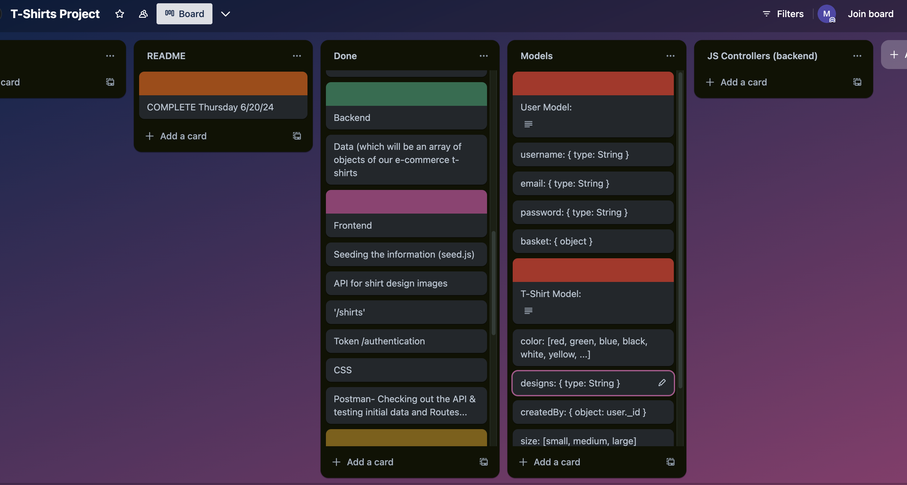
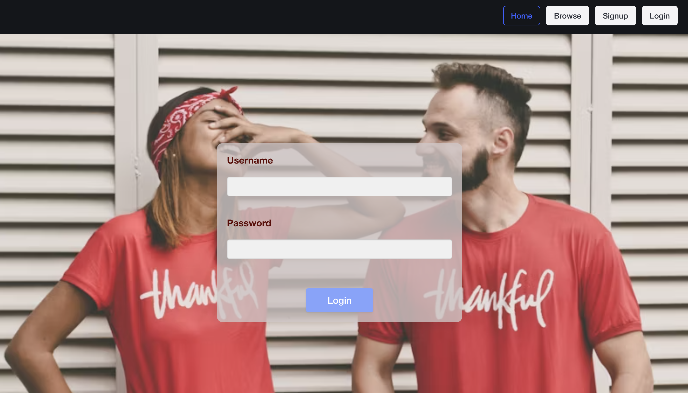
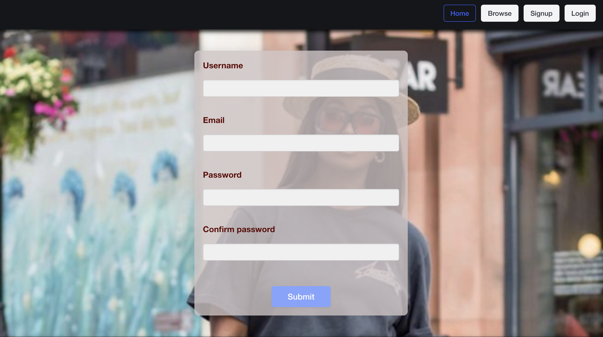
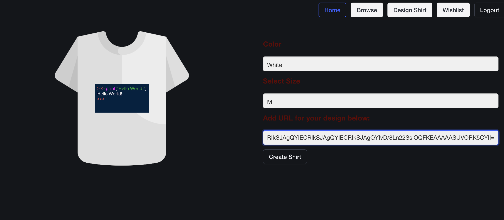
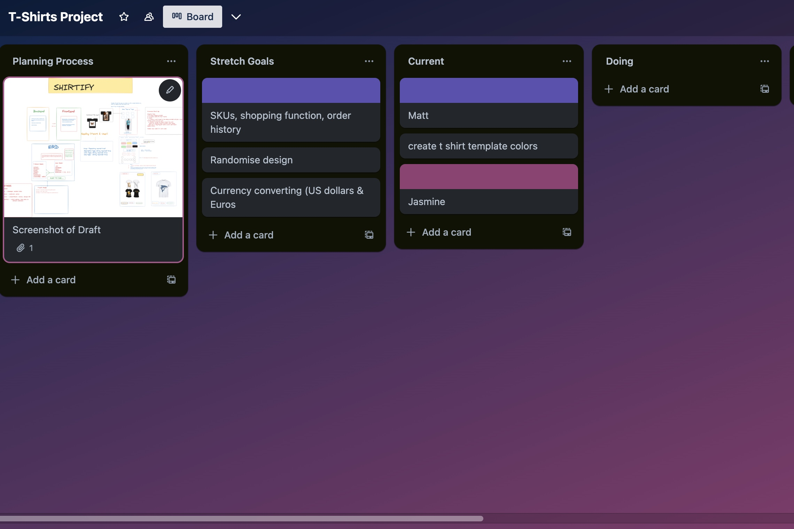

# Shirtify


## Project Overview
Shirtify is a comprehensive web application designed to provide users with an interactive platform to browse, customize, and share a collection of shirts. <br />
Users can sign up, create a profile, and log in to utilize the app's full functionality. <br />
Upon logging in, users can explore an extensive collection of shirts, add shirts to their wishlist, and personalize shirts by inserting designs and selecting sizes. <br />
The app supports full CRUD functionality for managing wishlists, enabling users to create, read, update, and delete shirt entries. <br />
Customized shirts can be shared in the browse collection, allowing other users to add these shirts to their wishlists. <br />

## Link to Shirtify

****insert here****

## Inspiration

The idea for Shirtify stemmed from the desire to create a personalized and community-oriented shopping experience. <br />
By enabling users to customize and share their shirt designs, the app encourages creativity and interaction among its users. <br />
The goal was to develop an engaging platform where users can express their unique style and preferences while discovering and interacting with the designs of others. <br />

## Planning Process





## Features
1. User Authentication: Secure sign-up, login, and profile management.
2. Browse Collection: Explore a wide variety of shirts created by other users.
3. Wishlist Management: Add, update, and delete shirts in the user's wishlist.
4. Shirt Customization: Insert designs and select sizes for shirts.
5. Community Sharing: Save customized shirts to the browse collection for others to discover.








## Challenges and Solutions
* Challenge: Formulating the logic to manage the complex interactions and data flow between user wishlists and the browse collection.
* Solution: Implementing a robust backend architecture with clear separation of concerns. Using controllers 
to handle specific routes and middleware for secure routes and token-based authentication.

## Group Project Experience
This was a group pair project that went well. Communication was essential, as well as delegating tasks to each other.
We helped each other debug the code and fix any issues that arose.



# Components Included

* Frontend Components:
Pages: Home, Login, Signup, Navbar
Components: WishItem, Wishlist
Main App: App.jsx

* Backend Components:
Configuration: environment.js
Controllers: auth.js, shirt.js, wishlist.js
Database: MongoDB, seeded data, seed.js, helpers.js
Custom Errors: customErrors.js
Middleware: Error handling, secure routes
Models: shirt.js, user.js

# Technologies Included

* Technologies:
Frontend: HTML, CSS, JavaScript, React, Bulma (CSS library)
Backend: Node.js, Express.js
Database: MongoDB
Authentication: JSON Web Tokens (JWT)
API Testing: Postman
Middleware Libraries: Method-override, Morgan, Dotenv
Package Management: package.json

# MERN Integration 

## Frontend App.Jsx
```
import { BrowserRouter as Router, Routes, Route } from "react-router-dom";
import Navbar from "./components/Navbar";
import Home from "./components/Home";
import Signup from "./components/Signup";
import { ToastContainer } from 'react-toastify'
import Login from "./components/Login";
import Browse from "./components/Browse";
import Design from "./components/Design"
import Wishlist from "./components/Wishlist";
import WishItem from "./components/WishItem";

function App() {
  return <>

  <Router>
  <ToastContainer
  autoClose={1300}/>
    <Navbar />
    <Routes>
      <Route path="/" element={<Home />} />
      <Route path="auth/signup" element={<Signup />} />
      <Route path="auth/login" element={<Login />} />
      <Route path="shirts/browse" element={<Browse />} />
      <Route path="shirts/design" element={<Design />} />
      <Route path="/wishlist" element={<Wishlist />} />
      <Route path="/wishlist/:wishId" element={<WishItem />} />
    </Routes>
  </Router>
  
  </>
}

export default App

```

##Backend Seed.js


```
import Shirt from "../models/shirt.js";
import User from "../models/user.js";
import { connectToDb, truncateDb, disconnectDb } from './helpers.js'
import seedData from './seedData.js'


async function seed() {
  
      await connectToDb()
     
      await truncateDb()
    
  
      const adminUser = await User.create({
        username: 'admin',
        email: 'admin@email.com',
        password: 'password',
        isAdmin: true,
      })
      
  
      const shirtsWithCreatedByAdmin = seedData.map(shirt => {
        shirt.createdBy = adminUser
        return shirt
      })

      const shirts = await Shirt.create(shirtsWithCreatedByAdmin)

    await disconnectDb()
  
  }
  
  seed()

```
# Frontend Dependencies 
```
{
    "axios": "^1.7.2",
    "react": "^18.3.1",
    "react-dom": "^18.3.1",
    "react-router-dom": "^6.23.1",
    "react-toastify": "^10.0.5"
  }
```

# Backend Dependencies 
```
 {
    "axios": "^1.7.2",
    "bcrypt": "^5.1.1",
    "cors": "^2.8.5",
    "dotenv": "^16.4.5",
    "express": "^4.19.2",
    "jsonwebtoken": "^9.0.2",
    "mongoose": "^8.4.1",
    "mongoose-hidden": "^1.9.1",
    "mongoose-unique-validator": "^5.0.0",
    "nodemon": "^3.1.3",
    "toastify": "^2.0.1"
  }

```
# Deployment


This project is deployed using Netlify, leveraging GitHub integration for seamless updates. Here’s a detailed outline of the deployment process:

* Deployment Setup
Netlify Configuration:

1. The project is hosted on Netlify to streamline deployment and hosting processes.
Continuous deployment is enabled by linking the project directly to the GitHub repository.
Environment Variables:

2. For security reasons, sensitive information such as API keys or credentials are stored in environment variables.
* These variables are managed using Netlify’s environment variable settings, ensuring they are securely stored and accessible only during deployment.

3. Steps for Deployment
Push to GitHub:

* Any changes made to the project are first committed and pushed to the GitHub repository.
Automatic Deployment:

4. Netlify is configured to monitor the GitHub repository.
* Upon detecting changes (commits or merges to the main branch), Netlify automatically triggers a new build and deployment process.

5. Build Process:
* During deployment, Netlify installs dependencies, compiles assets, and prepares the application for hosting.
* Any environment variables configured on Netlify are injected during this build process.
Hosting:

6. Once the build process is complete, Netlify hosts the deployed application.
* The application is accessible via a secure URL provided by Netlify.
Local Development and Testing
* For local development, ensure necessary environment variables are set in a .env file (not committed to GitHub) or configured in your local development environment.


